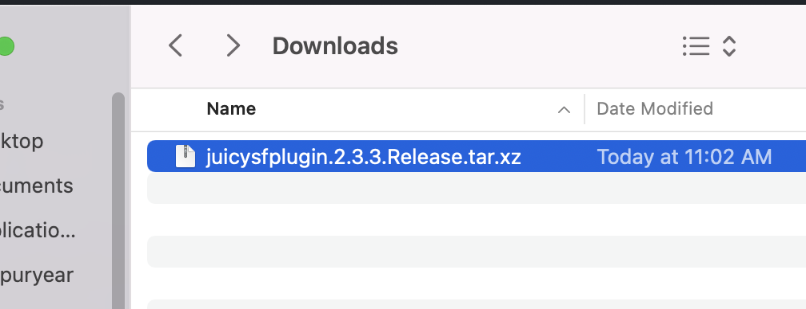
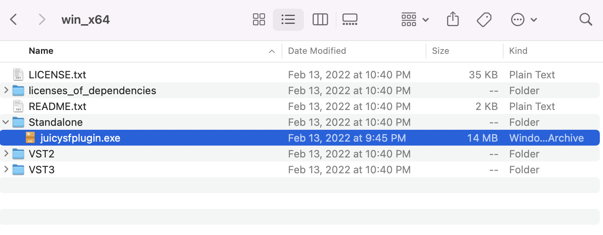
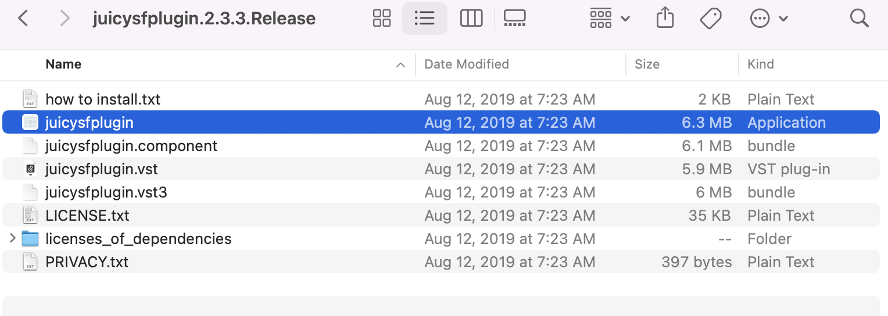
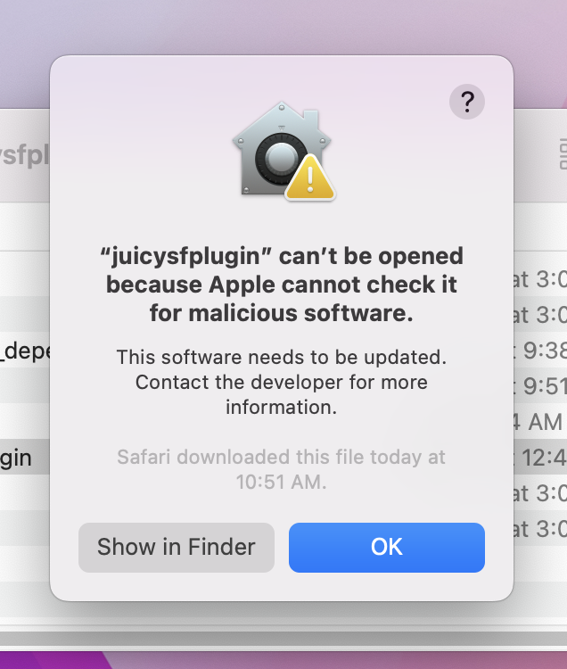
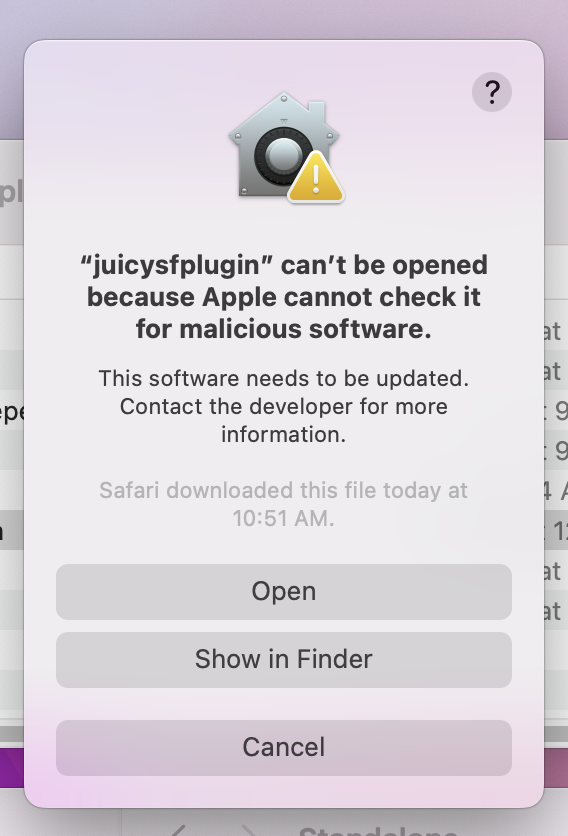
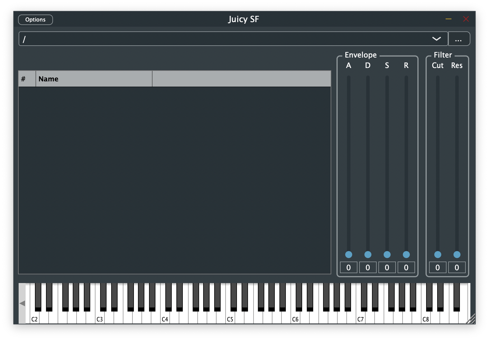
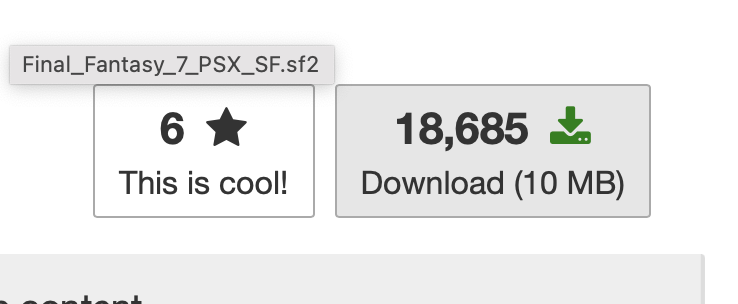
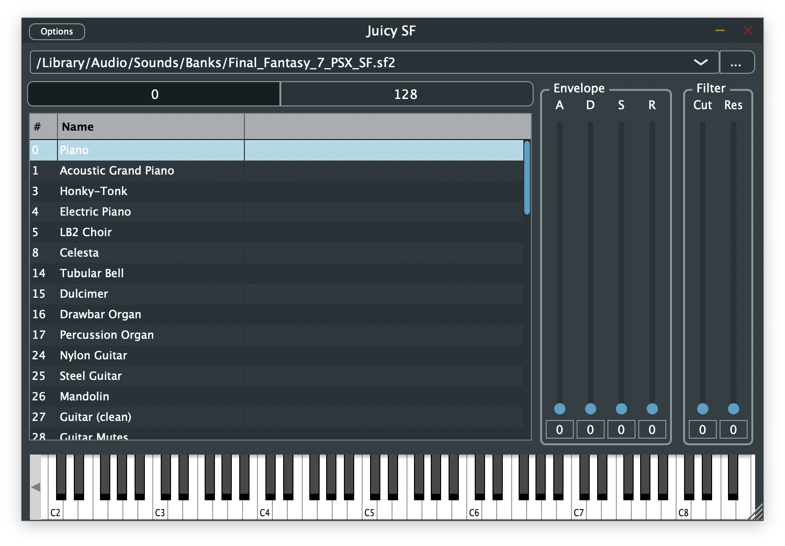
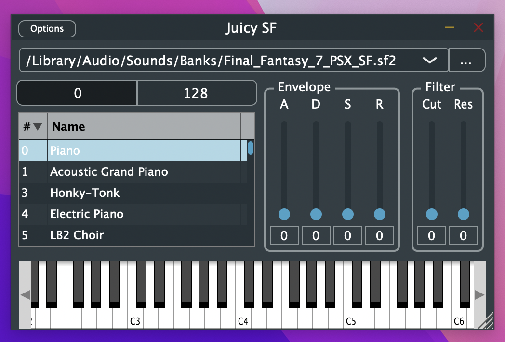
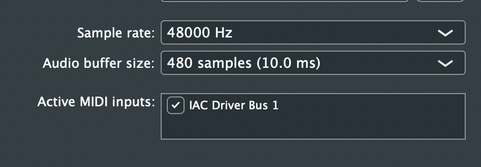

# Prework

Hey everyone, this markdown file will go over the prework that you will need to do in order to follow along with some later MIDI usage!

The prework is catered for MacOS, but every file/application has a windows alternative that I will also link.

ALSO, for Windows users, you will not be able to follow along completely with the demo. This prework is just a way for you to familiarize yourself with the programs. You really do not have to do any of this, but you can still mess around with the result if you want. Having a Soundfont player is a very niche but awesome thing for any audiophile!

## Downloads

### JuicySF

1. Download the corresponding `.tar.xfz` or `.zip` for your system:

    * MacOS: <https://github.com/Birch-san/juicysfplugin/releases/tag/2.3.3.macOS>
    * Windows: <https://github.com/Birch-san/juicysfplugin/releases/tag/3.1.0>

    Note: The MacOS version release is older than Windows because I ran into errors with 3.1.0 and 3.0.0 on Mac.  
    The reason I want Windows users to use 3.1.0 is because release 3.0.0 was the first time they released a standalone `.exe` for windows. (No one likes installing things on Windows when it can be a portable app)

    

2. Unpack the compressed file
    * Windows
    
    * MacOS
    

3. Open `juicysfplugin` on Mac, `standalone/juicysfplugin.exe` on Windows

    * You may (probably will) be asked if you are sure you would like to open this app
    
    * On MacOS, press OK, then hold down shift and right click open the file
    

4. Make sure it works

    * The program should look something like this
    
    * If the program doesnt run or looks different, let me know and I'll try to help

5. Keep this file open, we will be testing the next download with this program

### Final Fantasy VII Soundfont

First off, Soundfonts are basically

1. Download the Final Fantasy VII Soundfont
   * Final Fantasy VII has one of the most, if not the most recognizable Soundfonts in any game.
   * The moral grey area... This file was posted to a music archival forum. The Soundfont was created by someone by extracting the files from the game. The original composer *Nobuo Uematsu* has never publically released any soundfonts.
     * Link to the `.sf2` is here <https://musical-artifacts.com/artifacts/588>
        

## Testing JuicySF and the FF7 sf2

1. Return to the JuicySF application
2. Select the 3 dots near the top right of the application to select a specific Soundfont
3. Navigate to and select the `Final_Fantasy_7_PSX_SF.sf2` downloaded in the previous stages
4. Check that the application looks like the following
    
5. Make sure the audio settings are correctly set up
   1. Select Options in the top left
   2. Select Audio/MIDI settings
   3. Make sure the Output device is the desired output (Sound **WILL** be sent to this device)
   4. Keep the Sample rate the default (Most likely you don't need to change it, let me know if the value is not one of the following: 44100 Hz, 48000 Hz, 88200 Hz, or 96000 Hz)
   5. Make sure the Audio buffer size is higher than 256 samples (the higher the value, the greater the sound quality is at the cost of a delay.
      * Normally I would recommend a balance between the audio quality and delay, but for this demo the delay does not matter whatsoever
   6. During the demo there will be an Active MIDI input, so keep in mind that this is where you find the option to toggle those on and off.
6. Close the Options window and press on different notes on the keyboard to make sure that it is making noise!
7. It's a lot of fun messing around with parameters and exploring how Video Game Music Soundfonts worked!
   * Fun Fact: If you've played FF7 before, LB2 Choir is the vocals for the Sephiroth theme. Select that sound and press `C3` on the piano! The vocals were split into repeated phrases and seperated chromatically from notes `C3` to `F3` as a way of compressing the file size. Lyrics in Video Game Music, or even Soundfonts in general, was extremely uncommon due to the way that Soundfonts work. *Uematsu* and the sound team really wanted there to be lyrics to this song since it is the final boss (and also a multi-hour boss fight), so they devised this strategy as a way to divide a vocal sample into subsamples. There is actually a theory that the entirety of the Sepheroth battle is on a separate disc (disc 3) as a way to include higher quality assets (both musically and visually)!

## Note to Windows Users

Windows does not come with a native virtual MIDI driver, and my demo will sadly require one.  
Virtual MIDI drivers are extremely complex and in all fairness I do not want you to have to download and set up one.  
I'm really sorry if you were looking forward to programming alone-side me (Trevor), but I do not feel comfortable asking you to modify the drivers of your computer (especially adding ones I have not personally used since virtual MIDI driver's are new to me, so I haven't done it back home). If you feel comfortable researching and finding a way to get it set up, continue with this document!  
If not, you are done with the setup :)  

If you really want to try it you can go for it. For the demo we will want to have an open Virtual MIDI port. To test out if you have any open you can do the following after installing `mido` and `python-rtmidi`

```py
>>> conda install mido (pip install mido)
>>> pip install python-rtmidi
import mido
print(mido.get_output_names())
```

If anything is printed, then you should be good for the demo. Skip to step 6 in the next section to see if it shows up in JuicySF.

## Setting up an IAC Bus on MacOS

So this is cheating a bit, but I will just copy and paste the steps I layed out in my Research Log

### Requirements

* Not in a docker container (I'm sorry Gina, but we will need to be able to access ports and such)
* `conda install mido` or `pip install mido`
* `pip install python-rtmidi`

### General Setup

1. Open `Audio MIDI Setup`
    
    
1. Show the `MIDI Studio` window
    
    
1. Double click on the IAC Driver to open its properties
    
1. Check the `Device is online` option
    
1. Have a program to receive MIDI input open
    
1. Make sure the MIDI input is set to `IAC Driver Bus 1` in the `Options` tab
    
