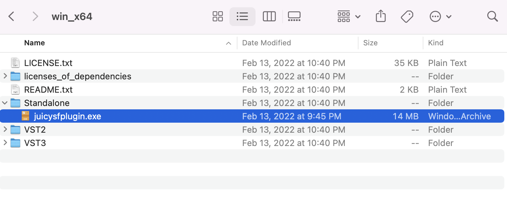
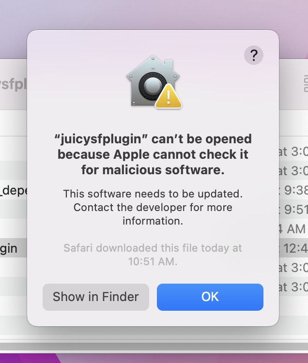

# Prework

Hey everyone, this markdown file will go over the prework that you will need to do in order to follow along with some later MIDI usage!

The prework is catered for MacOS, but every file/application has a windows alternative that I will also link.

## Downloads

### JuicySF

1. Download the corresponding `.tar.xfz` or `.zip` for your system:

    * MacOS: https://github.com/Birch-san/juicysfplugin/releases/tag/2.3.3.macOS 
    * Windows: https://github.com/Birch-san/juicysfplugin/releases/tag/3.1.0 

    Note: The MacOS version release is older than Windows because I ran into errors with 3.1.0 and 3.0.0 on Mac.  
    The reason I want Windows users to use 3.1.0 is because release 3.0.0 was the first time they released a standalone `.exe` for windows. (No one likes installing things on Windows when it can be a portable app)

    

2. Unpack the compressed file
    * Windows
    
    * MacOS
    

3. Open `juicysfplugin` on Mac, `standalone/juicysfplugin.exe` on Windows

    * You may (probably will) be asked if you are sure you would like to open this app 
    
    * On MacOS, press OK, then hold down shift and right click open the file 
    

4. Make sure it works

    * The program should look something like this
    
    * If the program doesnt run or looks different, let me know and I'll try to help

5. Keep this file open, we will be testing the next download with this program

### Final Fantasy VII Soundfont

First off, Soundfonts are basically 